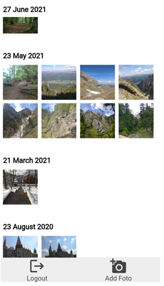
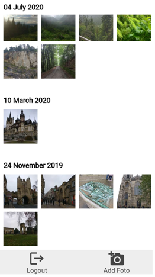
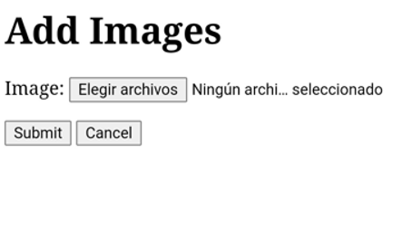
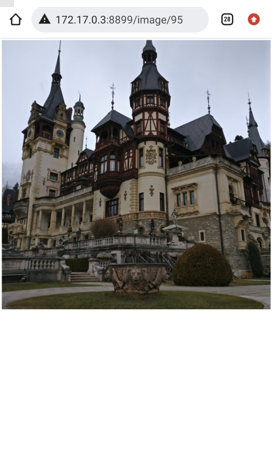
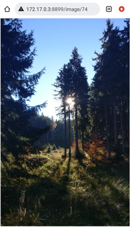
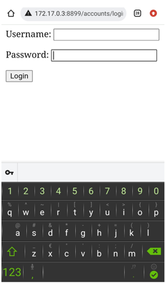

# Online_Image_Gallery
This is a Django & Docker application that offers a centralized platform to store and manage all your images and photos. It utilizes three containers: a MySQL container to securely store your data, an Nginx container to handle HTTP requests and serve the application's UI, and an App container that runs the Django application itself. The app provides a simple and intuitive interface to access your photos and images, making it easy to organize and categorize your memories.

## Setting up the App

### Prerequisites:

- Clone this project repository to your local machine
- Docker should be installed on your machine

### Running the Application:

1. Open a terminal in the root directory of the cloned project

2. Run the following command: `docker-compose up --build` 
- Alternatively, you can run the following command to run the containers in detached mode: `docker-compose up -d --build`

3. Wait for the containers to start.

**Note:** The first time you build the image, the gallery container may fail to run because the MySQL container takes longer to set up. In this case, wait for a few seconds for the MySQL container to fully set up, and then run the gallery container again. Command: `docker start gallery`

4. After that the app will be running on `localhost:80`

5. Create a new user by clicking `Create user!` button. 

6. Login with the user you just created

**Note:** To create a superuser (admin user), the only method is by accessing the terminal within the 'gallery' container, navigating to the 'Online_Image_Gallery' folder and executing the command `python manage.py createsuperuser`. This will allow you to access the app admin panel `localhost/admin/` using the created superuser credentials.

### Libraries used:

- Django
- Pillow
- django-imagekit
- django-exiffield
- django-dotenv
- mysqlclient
- gunicorn

### Features:

- Login for multiple users
- Upload multiple images
- Does not allow uploading the same image more than once per user
- Images sorted by creation date
- View images without losing image quality
- Separate media directories for each user.

 

The application can be accessed from any device with a browser and allows uploading images and viewing them without losing image quality.

The purpose of this application is to be able to access all your images without taking up space on your device.

 

This application can be accessed by several users, each user will only have access to their own uploaded images and each user will have their images saved in separate directories from the other users.

